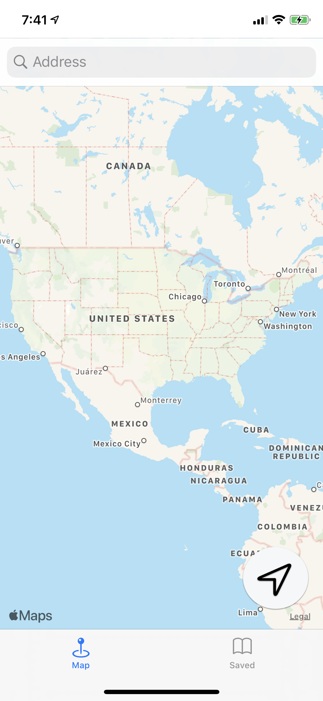
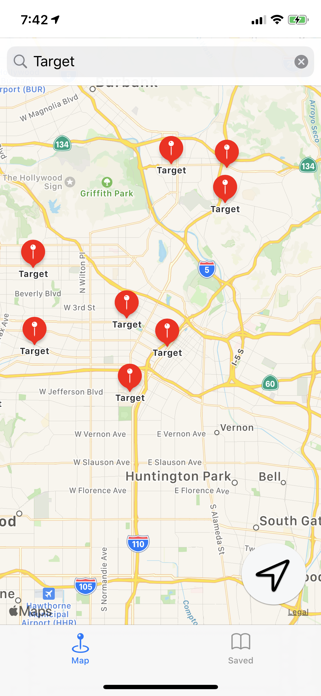
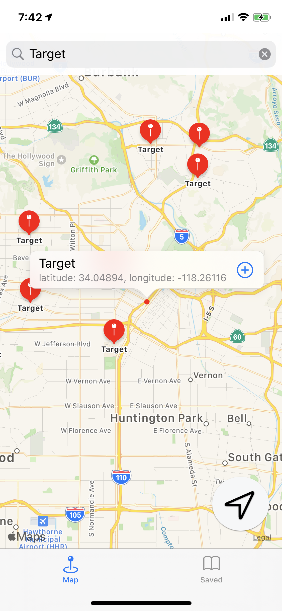
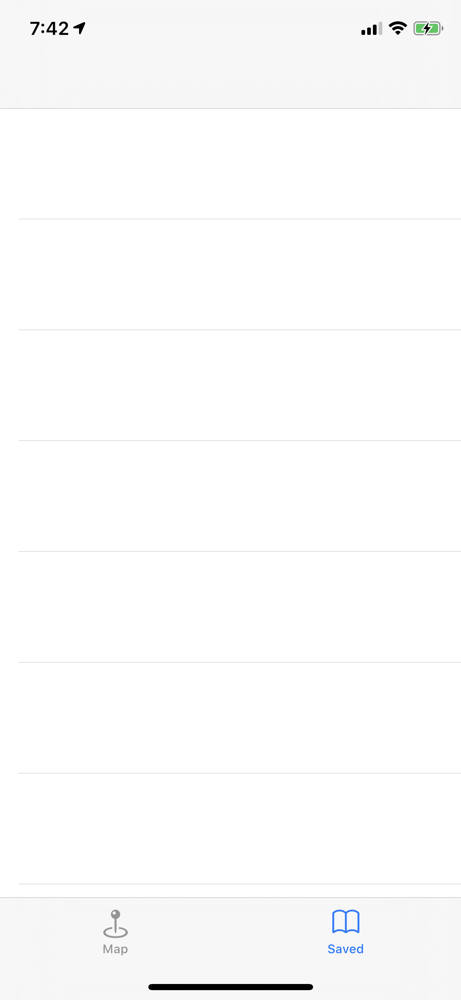
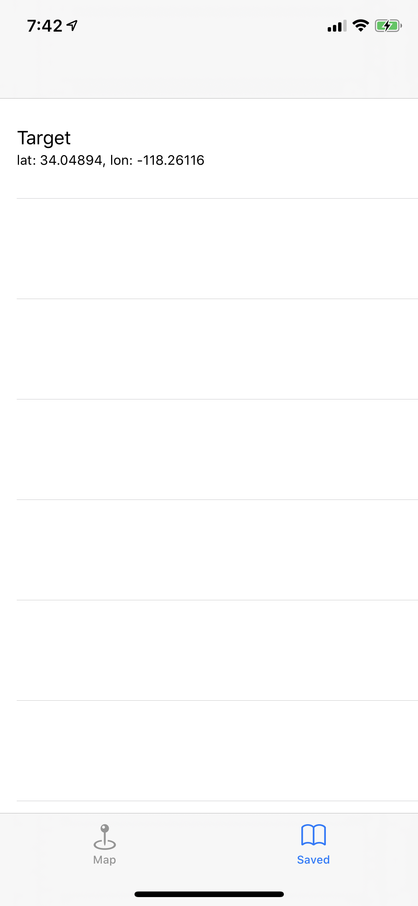
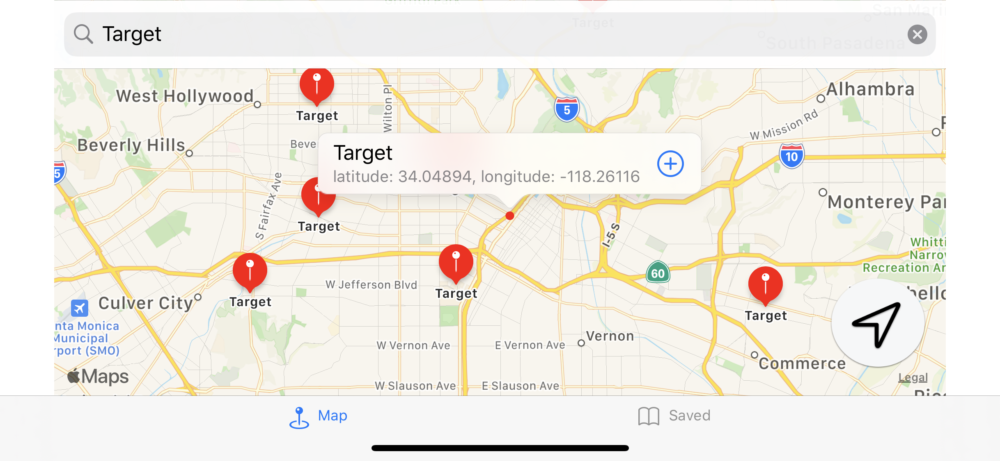
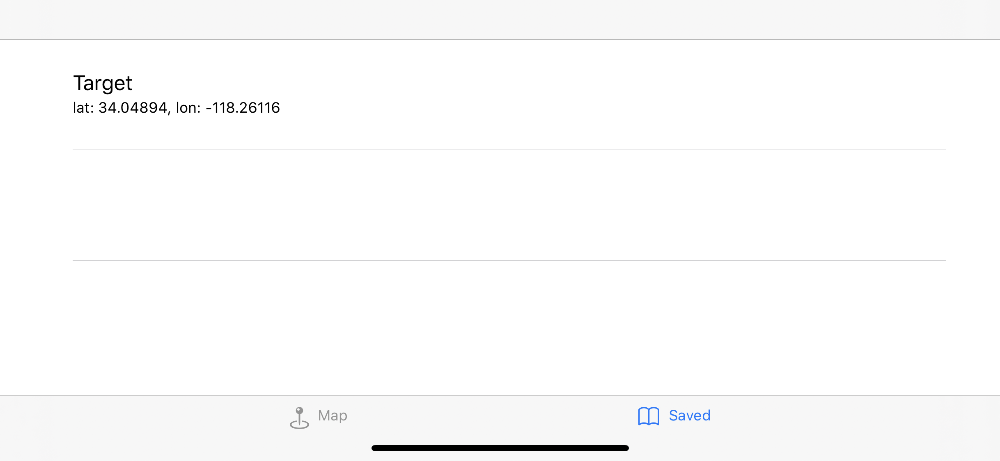

# Get Coordinates, iOS Developer: Elias Hall

**Run Instructions:** Xcode 11.5, iOS Deployment Target: iOS 13.4, iPhone 11 Pro

**Overview:** With 'Get Coordinates', users can search for a location, by entering the location's name in a search bar, and see the returned location's coordinates on a map. The user can save the location's coordinates to a tableView, where it is saved using core data

**Walkthrough**
In tab1, the user enters a location in the search bar. The input string is run through the natural language query api, where it will return results, within a set region, and present them as balloon MKAnnotation views. The map will zoom into the region of the first returned result. If user wants to view their current location, they need to tap the location button on the bottom right of the screen. User must grant permission for app to use user's location. If the user taps on the annotation view, a call out white box appears with the location's name and coordinates, there, the user can tap on the blue 'add' button to save the location's details to Core Data and add it to the table view when generated in tab2.

**Tools used:** Xcode 11.5, UIKit, iPhone simulator/device, Core Data, MapKit, CoreLocation

**Select below for larger clearer image**

